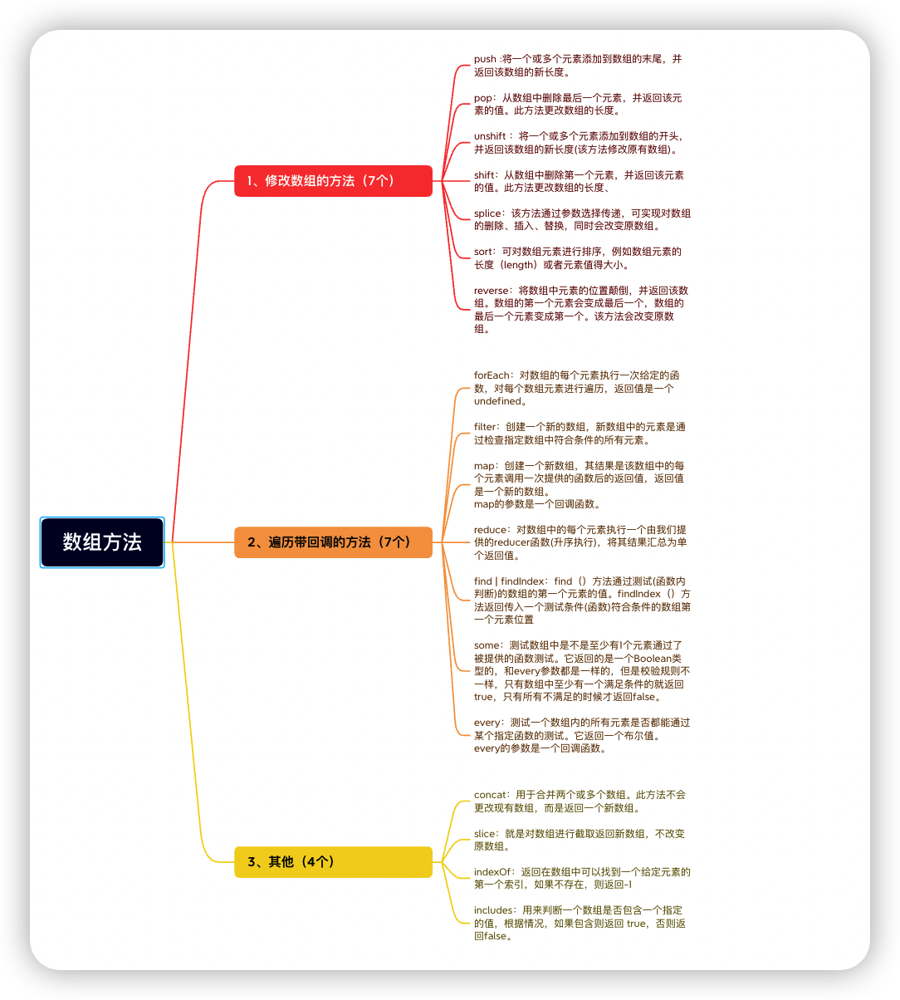

# 常用的数组方法的总结

## 1.修改数组的方法（7个）

### push：

将一个或者多个元素添加到数组的尾部，并返回该数组的长度

### pop：

从数组中删除最后一个元素，并返回该元素的值，此方法更改数组的长度

### unshift：

将一个或多个元素添加到数组的开头，并且返回该数组新的长度，此方法修改了原有数组

### shift：

从数组中删除第一个元素，并返回该元素的值，此方法更改数组的长度

### splice：

该方法通过参数，可以实现对数组的删除，插入，替换，同时会改变原数组

### sort：

可以对数组元素进行排序，例如数组元素的长度，或者元素值的大小

### reverse：

将数组中元素的位置颠倒，并返回该数组。数组的第一个元素，变成最后一个。该方法改变了原数组

## 2.遍历带回调的方法（8个）

### forEach：

对数组的每个元素执行一次给定的函数，对每个数组元素进行遍历，返回值是undefined

### map：

创建一个新的数组，返回值是数组中每个元素调用一次提供的函数后的返回值，map的参数是一个回调函数。

### reduce：

会遍历数组的中的元素,每遍历一次就会执行一次回调函数,遍历完将结果返回出去

### filter：

遍历数组的所有元素，有就返回一个数组，没有就返回一个空数组。

### find 和findIndex：

find：依次遍历数组中的元素，找到第一个符合条件的元素,就不再继续遍历了

findIndex:遍历数组查询有返回当前元素的索引，没有就返回-1,也只匹配第一个存在的元素

### some:

遍历数组的每一项，若其中一项为 true，则返回true。可以理解为：一真即真 

some一直在找符合条件的值，一旦找到，则不会继续遍历下去。

### every：

遍历数组每一项，若全部为true，则返回true。可以理解为：全真为真，一假即假。

every从遍历开始，一旦有一个不符合条件，就不会继续遍历下去。

## 其他方法（5个）：

#### concat：

用于合并两个或多个数组，此方法不会改变现有数组，而是返回一个新数组。

### slice：

对数组进行截取返回新数组，不改变原有的数组

### indexOf:

返回数组中某个指定的元素位置。如果该元素不存在返回-1。

### includes：

返回值是布尔类型的。判断数组中是否有该元素，如果有返回true，如果没有返回false。

